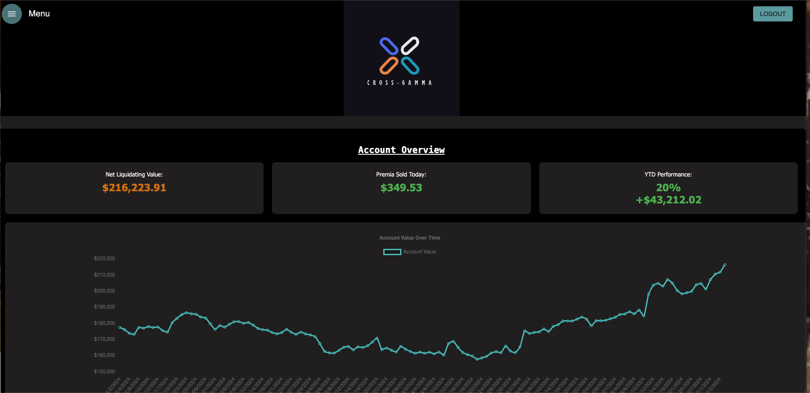
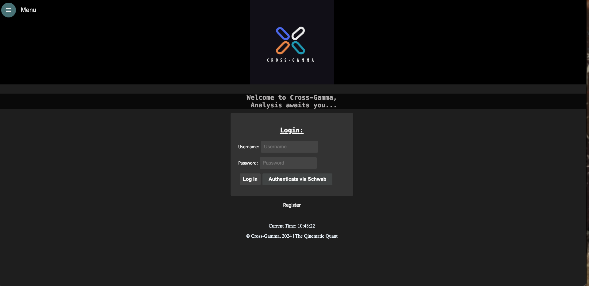
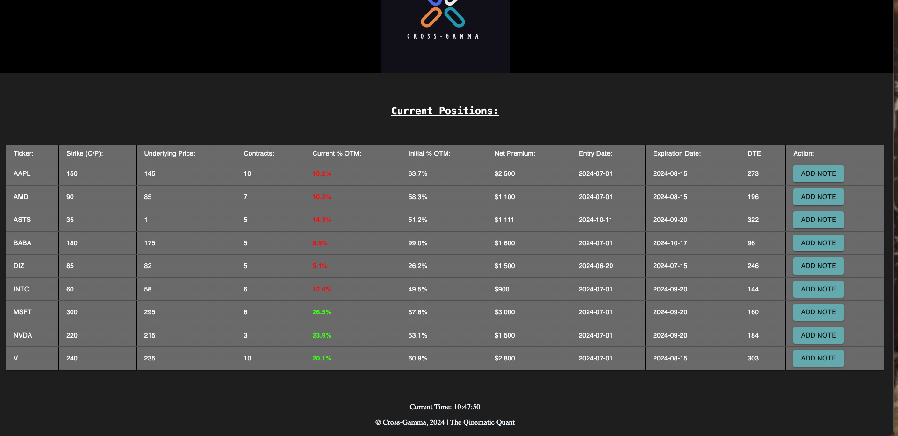
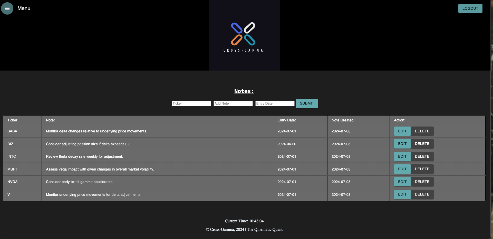

CrossGamma

Overview:

CrossGamma is a full-stack web application designed for options trading analysis. Built with React, Redux, Express, and PostgreSQL, it allows users to manage and analyze trading data efficiently. This application aims to provide traders with insights and tools to make informed decisions.

Features:

User authentication and session management
Secure data storage with PostgreSQL
Responsive user interface built with React
State management with Redux
Real-time data updates
Analysis tools for options trading

1. **Dashboard**: Get a quick overview of your overall account status.
   
   

2. **Login Screen w/ OAuth button**: Create and register new users and authenticate via Schwab.

   

3. **Position Management**: View and manage all your trading positions in one place.

   

4. **Take notes on open positions and future positions you intend on entering (set reminders/alerts to enter)**: Create comprehensive notes on each positon you have open and notes about positions you wish to enter as well.

   

Installation
Prerequisites:

Make sure you have the following software installed on your computer:

Node.js
PostgreSQL
Setup

Clone the repository:

'git clone https://github.com/yourusername/crossgamma.git'

cd into crossgamma

Install dependencies:

'npm install'

Create a PostgreSQL database (information for tables is provided in the database.sql file within the project directory)

Create a .env file at the project root with the following content:

'SERVER_SESSION_SECRET=<yourRandomSecret>'

Start the PostgreSQL server.

Start the application:

'npm run server'
'npm run client'
Open your browser and navigate to http://localhost:<address>

Usage:

Register a new user account.

Log in with your credentials.

Use the dashboard to view and analyze your trading data.

Utilize the various tools and features to enhance your trading strategies.
